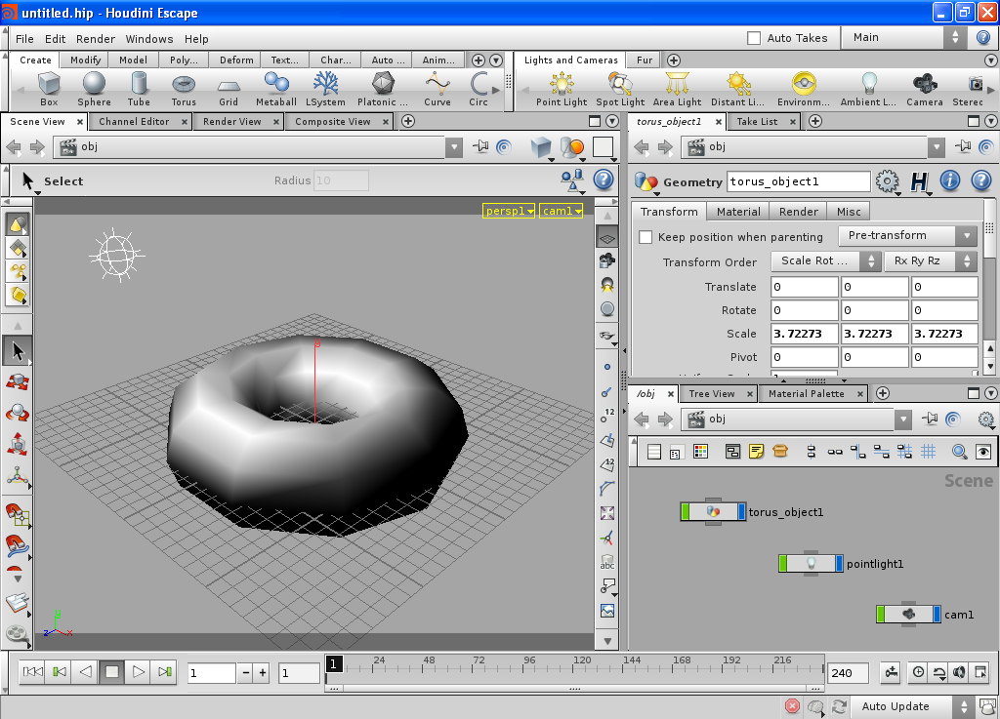
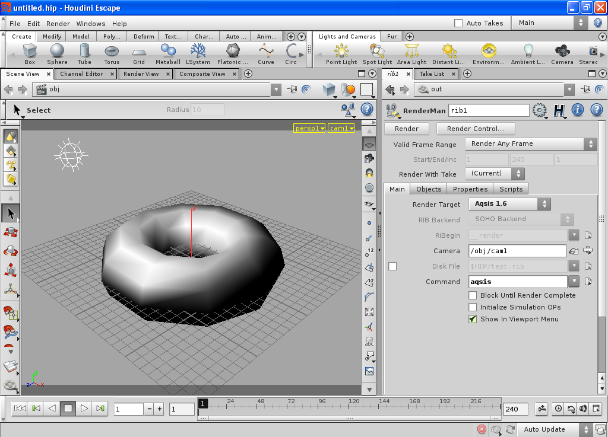
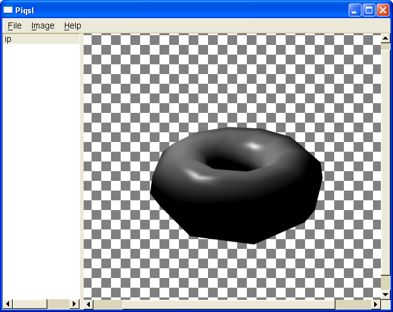

.. _Framebuffer: ../../common/piqsl

=================
Rendering a Torus
=================

The purpose of this example is to demonstrate the steps required for rendering a Houdini scene with Aqsis:

   The Houdini scene.

Creating the Scene
==================

Using the shelf/toolbar:

#. Select **Torus** and place within your workplane.
#. Select **Point Light** and place within your scene.
#. Select **Camera**, repositioning it if necessary.

.. warning::
   The rendering process will fail if no camera is specified (nothing to render).

Rendering the Scene
===================

Using the main-menu:

1. Select **Render** > **Create Render Node** > **RenderMan**.
2. Navigate to the **Main** tab and ensure the **Render Target** is set as **Aqsis** and the Command field is set as ``aqsis``:

   Houdini's "Render" settings.

3. Select **Render** > **Start Render** > **rib1**, which will result in Aqsis being opened and the scene being rendered to the `Framebuffer`_:

   The Aqsis render.

