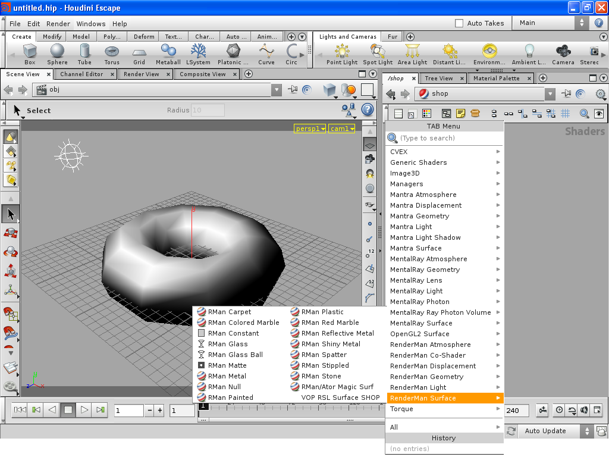

====================================
Using RenderMan Shaders with Houdini
====================================

Materials
=========

1. Navigate to the **Shop** network and press the **Tab** key, then select the **RenderMan Surface** > **RMan Plastic shader**:

   Houdini's "SHOP" dialog.

2. The shader parameters are now available and can be edited, if necessary:

.. figure:: _static/houdini-renderman_surface_parameters.png
   :scale: 75
   :align: center

   Houdini's "Shader" parameters.

3. Assign the shader to your model/material.

.. note::
   The default Aqsis shader library can be imported into Houdini using **File** > **Install Digital Asset Library** and selecting the ``~/plugins/houdini/hshaders.otl`` file distributed with Aqsis Renderer.

Lights
======

All default lighting types (ambient, point, spotlight, etc) are supported, though it's also possible to use RenderMan shaders by assigning the relevant shader to the Houdini light - Handled in a similar fashion to materials.

.. warning::
   Geometry may render black if no lighting is used within the scene.

