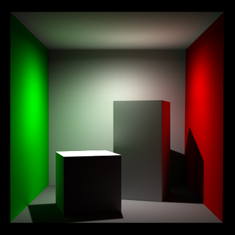
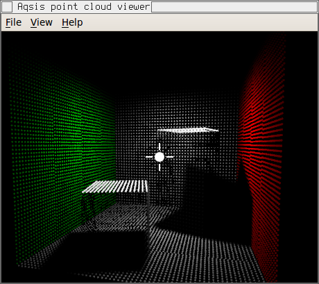
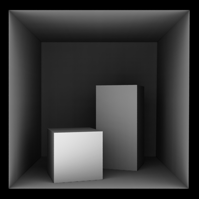

===============================
Point Based Global Illumination
===============================

**Point-based global illumination** (PBGI) is a set of techniques which
compute lighting using a point cloud to approximate the scene geometry and
direct light.  By first "baking" the geometry and incoming direct light to a
point cloud, we transform a scene containing arbitrary geometry types and
surface properties into a uniform representation.  This uniform representation
allows for a simple *hierarchical* approximation to the scene to be
constructed.

For indirect lighting, geometry far from a given point should have only a
small effect on the incoming light, so we would like to represent such
geometry at low resolution.  A hierarchy allows us to do exactly this: use
coarse levels of the hierarchy for distant geometry but more detailed levels
for nearby objects.

(Note that we use the term "point cloud" here rather loosely.  For representing
surfaces, the points are really small disks with a given radius and normal.
True point-like data would at most have only a radius and be better
represented as a small sphere rather than a disk.)

The PBGI implementation introduced in Aqsis-1.8 draws from several sources for
inspiration.  Most notably, the two papers [Christensen2008]_ and
[Ritschel2009]_ describe similar systems.

The simplest use of PBGI is as a two pass technique.  The procedure is as
follows:

1. An appropriate point cloud is generated in the *baking pass* using a shader
   containing the ``bake3d()`` shadeop.  The output from this pass is a point
   cloud file containing the tessellated geometry and possibly information
   about the direct lighting.
2. The *beauty pass* uses the point cloud file generated in the baking pass to
   compute illumination.  The ``occlusion()`` shadeop may be used to compute a
   purely geometric ambient occlusion term, while the ``indirectdiffuse()``
   shadeop computes one bounce indirect lighting based by integrating any
   radiosity information stored with the points.

More complicated uses may include additional passes, but the tutorial which
follows concentrates on the two pass case for simplicity.

One bounce indirect lighting
============================

Let's set up a scene which renders the following image of the famous Cornell
box scene using a single bounce of indirect illumination.  Note the colors of
the walls bleeding onto the boxes and roof:

The files required to render this scene may be conveniently found in the
``examples/point_based_gi/cornellbox`` directory of the aqsis distribution.
Note that there's an additional pass required for creating the shadow map for
the direct lighting of the main light source for a total of three passes.
This isn't directly related to PBGI so it won't be dealt with here, other than
to say that it must happen *before* the baking pass.

The baking pass
---------------

In the baking pass we create a point cloud representation of the geometry
using the ``bake3d()`` shadeop.  For indirect diffuse illumination the
radiosity must also be baked into the point cloud so that it can be read out
during the beauty pass.  Here's the surface shader used for the baking:

.. literalinclude:: /../../../examples/point_based_gi/cornellbox/bake_points.sl
   :language: rsl

There's several important features to note about the use of ``bake3d()`` here

1. The area of each surface element is saved to the point cloud using the
   special channel name ``_area``.
2. The radiosity is the radiant energy leaving the surface per unit area,
   integrated over the hemisphere.  (It's assumed to have no directional
   dependence other than the geometric Lambertian factor defined by the
   surface normal.)  You must bake the radiosity to the point cloud using the
   channel name ``_radiosity``.
3. In order to generate good quality point clouds it's important to turn on
   the ``interpolate`` option.  This causes the renderer to interpolate
   between micropolygon vertices to create one disk per micropolygon.  Without
   this option we end up with duplicate points wherever two micropolygon grids
   meet.
4. The point cloud file should normally be named with a ``.ptc`` extension,
   since the extension is used to determine the file type.  (Aqsis uses the
   Partio library for point cloud IO, so in principle any format supported by
   Partio may be used, including appending ``.gz`` to zip up the file to save
   space.)

As well as getting the baking shader right, we need to set some extra renderer
attributes to make sure the point cloud has good quality.  Here's the RIB file
for the baking pass:

.. literalinclude:: /../../../examples/point_based_gi/cornellbox/bake_pass.rib
   :language: RIB

The important thing to note here is that three attributes ``cull:backfacing``,
``cull:hidden`` and ``dice:rasterorient`` have been disabled.

Turning off culling makes sure that even some parts of the scene which we
wouldn't normally see from the camera (eg, due to being hidden by other
geometry) are present in the point cloud.  This is obviously necessary because
they may reflect light on parts of the scene which are in direct view.

It's also important to turn off raster oriented dicing so that the
micropolygon size is independent of the direction of the surface normal.
If we didn't do this then the renderer would produce very large disks for
surfaces viewed at a glancing angle.

The generated point cloud can be viewed using the aqsis point cloud viewer
application ptview (TODO: this name may change shortly).  Here's the kind of
thing you should expect to see.  Note that in this example the shading rate has
been increased so you can make out the individual points more easily.

The beauty pass
---------------

Having created the point cloud with a representation of the direct
illumination, shaders in the beauty pass should call the ``indirectdiffuse()``
shadeop to integrate this illumination at each shading point.  Here's a very
simple shader which does the trick (see ``indiret.sl``):

.. literalinclude:: /../../../examples/point_based_gi/cornellbox/indirect.sl
   :language: rsl

The ``indirect`` shader may be called from the RIB file as follows

.. literalinclude:: /../../../examples/point_based_gi/cornellbox/beauty_pass.rib
   :language: RIB

There are two main tuning parameters which cover the trade off between speed and
quality in the aqsis implementation of PBGI.

1. The ``maxsolidangle`` parameter gives the maximum solid angle of interior
   nodes of the point hierarchy which may be used.  Smaller values here will
   cause more points to be considered which leads to slower but more accurate
   renders.
2. The ``microbufres`` parameter gives the face resolution of the tiny
   environment buffer into which the illumination data is sampled when
   traversing the point hierarchy.  Larger values give more accurate results
   but take longer to render.  It seems like values of 20 or less should be
   reasonable for low frequency indirect illumination as seen in this image.

Ambient Occlusion
=================

Using the much the same technique it is also possible to compute ambient
occlusion.  Here's an example shader:

.. literalinclude:: /../../../examples/point_based_gi/cornellbox/ao.sl
   :language: rsl

When substituted into the beauty pass instead of the ``indirect`` shader with
the line

.. code-block:: RIB

   Surface "ao" "float microbufres" 10 "string pointCloudName" "box.ptc"

(see ``beauty_pass_ao.rib``), this produces the following image:

Additional PBGI Effects
=======================

TODO: Discuss light emitting surfaces and glossy reflections.

.. [Christensen2008] P. Christensen,
   `Point-Based Approximate Color Bleeding <http://graphics.pixar.com/library/PointBasedColorBleeding/paper.pdf>`_.
   Pixar, 2008

.. [Ritschel2009] T. Ritschel, T. Engelhardt, T. Grosch, H.-P. Seidel, J. Kautz and C. Dachsbacher
   `Micro-Rendering for Scalable, Parallel Final Gathering <http://www.mpi-inf.mpg.de/%7Eritschel/Microrendering>`_.
   ACM Trans. Graph. (Proc. SIGGRAPH Asia 2009), 28(5), 2009
